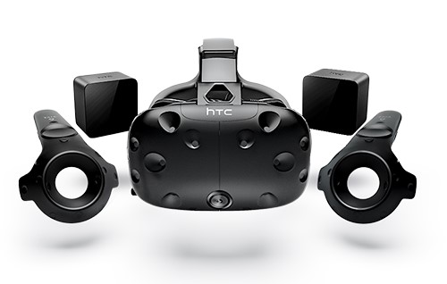
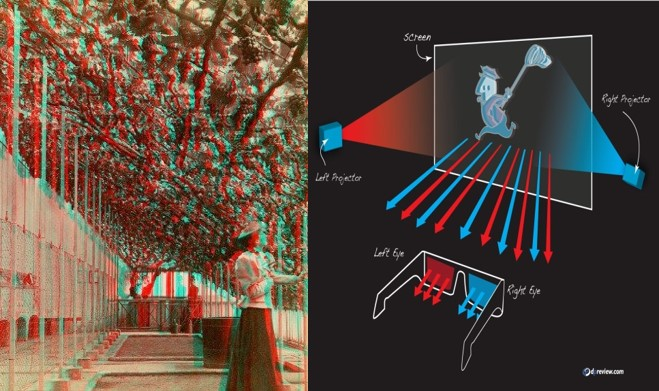
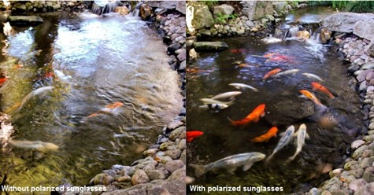
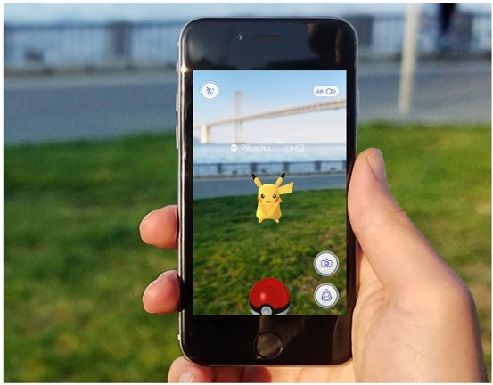

# 가상현실과 증강현실은 무엇인가

- 1. 가상현실의 정의
- 2. 가상현실의 역사
- 3. 가상현실에 적용된 기술
- 4. 증강현실의 정의
- 5. 증강현실의 역사
- 6. 증강현실에 적용된 기술
- 7. 가상현실 적용 예시
- 8. 가상현실/증강현실의 

## 1. 가상현실의 정의

> 컴퓨터 등을 사용한 인공적인 기술로 만들어낸 실제와 유사하지만 실제가 아닌 어떤 특정한 환경이나 상황 혹은 그 기술 자체

## 2. 가상현실의 역사

    일반적으로 알려진 사실에 따르면 1968년에 유타 대학의 이반 서덜랜드에 의해 고안된
    헤드 마운티드 디스플레이?(Head Mounted Display; HMD) 가 최초의 가상현실 시스템
    
    최초의 HMD 시스템은 유저(사용자)가 사용하기에 너무 무거워 천장에 고정되어 있었으며
    선으로 표현된 3차원의 영상으로 가상공간이 생성되었다고 함.
    또, 초기 가상현실 시스템 중 주목할 만한 것으로 1977년 MIT에서 만든 아스펜 무비 맵 (Aspen Movie Map)이 있다. 
    
    이는 사용자가 콜로라도 주의 아스펜으로 가상여행을 떠날 수 있게 해주는 가상현실 시스템이다. 

|     구분     |   설명   |
| ------------ | ----------- |
| 1990년도 이전 | ●마이크로소프트 연구소에서 HMD와 장갑형태의 가상현실 컨트롤러를 개발. |
||●NASA산하의 VIEW에서 가상현실 기기인 LEEP와 VIEW[VIVED]를 개발. 화성 무인탐사 시뮬레이션에 이용되었다. |
| 1990년대 | ●세가에서 SEGA VR를 개발도중에 있었으나 도중에 개발을 중단. |
|| ●닌텐도에서 버츄얼 보이를 개발. 적색계열밖에 보여주지 못했으며 무게가 무거워 별도의 지지대가 필요했다. 소프트웨어의 부족함과 함께 사람들에게 평이 좋지 못했다. 당시 180달러. |
|| ●CAVE 프로토타입 등장. 3D안경을 이용하여 가상현실을 공간화했다. |
| 2000년대 | 연구가 계속 진행되었으나 성과를 보인 부분이 없었다. |
| 2010년대 | 오큘러스 기업탄생. 잠잠했던 가상현실에 불을 붙였다.|
||12년 오큘러스 리프트 개발. 초기 기대와 달리 폭발적인 인기를 얻었다.|
||14년 오큘러스와 삼성의 협업으로 삼성 기어 VR 이노베이터 개발.|
||16년 소니에서 PS VR을 개발. PS게임에서 VR을 적극 지원하게 되는 계기가 되었다.|
||VR이 상승세를 보이자 게임제작툴도 이에 따라 개발되기 시작했다. 대표적인 게임제작툴로는 유니티/언리얼 엔진/크라이엔진이 있으며 기본적인 제작 기능을 무료로 사용할 수 있게 하고 있다.|

## 3. 가상현실에 적용된 기술

### 3-1. 에너글리프 방식

    적색과 청색의 필터를 가진 안경을 착용함으로써 화면을 입체감 있게 느끼는 기술.
    주로 영상을 보는데 사용되며 가격이 저렴하여 오랜기간 동안 사용되고 있다.
    다만 시각에 피로감을 많이 주는 단점이 있다.

### 3-2. 편광방식

    빛의 진행방향의 차이를 이용하여 화면을 입체감 있게 느끼는 기술.
    눈의 피로를 최소한으로 하고 (일부) 빛을 차단하여 사물을 보다 명확하게 볼 수 있다.
    가상현실에 적용시키기 위해서는 출력되는 빛이 편광 빛이어야 하는 단점이 있다.

## 4. 증강현실의 정의

> 사용자가 눈으로 보는 현실세계에 가상 물체를 겹쳐 보여주는 기술

## 5. 증강현실의 역사

    증강현실이란 개념은 라이먼 프랭크 바움의 1901년에 출간한 ‘The Master Key’라는 책이 주로 언급되고 있다. 
    이 책의 내용에는 ‘Character Marker’라 는 안경이 등장하는데 사람의 성격을
    G, E, W, F 등으로 이마에 문자를 보여주는 능력이 있다.
    
    이와 비슷한 안경을 2012년도에 구글이 ‘Google Glass’를 선보여 위의 책 속에 나오는 안경과 비슷하게 
    사람들의 정보를 띄워주는 안경형 증강현실의 맥이 이어가고 있다.
    물론, 증강현실을 이용할 수 있는 기기들은 1968년도에도 존재했는데
    이반 서덜랜드의 ‘experimental 3-D display’라는 기기로 초기 구현 사례이다.
    
    증강현실이라는 단어를 본격적으로 사용하기 시작한 시기는 1990년도로 톰 코델이 데이비드와 함께 
    비행기 제조 공정을 개선하기 위한 연구가 착용형 AR 기기 콘셉트로 진행하면서 사용되었다.

|     구분     |   설명   |
| ------------ | ----------- |
| 1990년도 이전 |● 점차 서브컬처에 등장하기 시작 |
||● 1968년, 이반 서덜랜드가 반투명 디스플레이를 사용하여 오늘날 스마트 글라스와 유사한  ‘experinmental 3-D display’가 개발되면서 초기계발이 이루어지기 시작한다.|
| 1990년대 |● 본격적으로 증강현실이란 단어를 사용하기 시작|
||● 톰 코델과 데이비드가 비행기 제조공정 개선을 연구하는 과정에서 착용형 AR기기를 콘셉트로 잡았다. |
||● 1992년에 루이스 로젠버그가 암스트롱 랩에서 개발한 Virtual Fixture’’라는 기기를 선보였다. 실제 사물에 3D 그래픽을 위치시키면서 작업을 하는 방식이다.|
|| ●CAVE 프로토타입 등장. 3D안경을 이용하여 가상현실을 공간화했다. |
| 2000년대 |● 소형화와 성능향상을 위해 개발을 하는 도중 아이폰의 등장으로 급성장을 이루기 시작한다.|
| 2010년대 |● 2012년에 구글이 ‘Google Glass’를 발표하면서 상당한 발전을 이룬다.|
||● 2012년에 구글이 ‘Google Glass’를 발표하면서 상당한 발전을 이룬다.|
||● 2016년에는 ‘포켓몬 GO’가 등장하여 스마트폰의 위엄을 다시금 보여준다.|
||● 이후에도 레노버, 루무스, ODG 등에서 글래스형 기기를 개발, 출시하고 있다.|

## 6. 증강현실에 적용된 기술

### 위치정보, 나침판, 기울기 센서
    GPS를 이용한 위치정보를 기반으로 사용자 주변 장소의 정보들을 송수신한다.
    디지털 나침반을 사용해 디바이스의 방향을 데이터화 해서 구현할 정보를 파악한다.
    다양한 센서, 특히 기울기센서를 이용해 디바이스가 향하는 공간을 파악해 정보를 가시화한다.
    ☞ 이처럼 증강현실을 이용하려면 디바이스의 도움뿐만 아니라 
    장소의 정보, 그리고 건물과 물건의 정보를 모두 데이터화 하여 매순간 송수신을 해야 한다.

## 7. 가상현실 적용사례

### 게임

### 예술

### 교육

|     구분     |   설명   |
| ------------ | ----------- |
| 의료 |해부학 실습을 위한 3차원 해부도 및 시뮬레이션, 가상 내시경, 모의수술 등에 사용됩니다.|
||가상 내시경은 인체 내부를 가상공간에서 가상적으로 탐험하면서 해당 부위를 살펴보는 것입니다.|
| 군사 |전투기나 헬기 등의 조종을 시뮬레이션으로 훈련하는 데 사용됩니다.|
||사격훈련, 전투상황 시뮬레이션에도 유용하게 사용됩니다.|
| 교육 |자동차 운전, 건축 설계, 안전 교육 등에 사용됩니다.|
| 엔터테인먼트 |게임뿐만 아니라 공연 및 전시 등 다양하게 활용됩니다.|
| 스포츠 |운동선수와 같이 1인칭 시점에서 스포츠 관람 또는 스포츠를 체험할 수 있습니다. 가상현실 전용 스포츠도 기대해볼 수 있습니다.|

## 8. 가상현실/증강현실의 문제점

### 8-1. 안정성 문제
    현재 인간의 신경신호를 이용하여 가상현실을 체험하는 방식이 연구 중에 있다.
    
    하지만 인간의 신경에 가상현실이 직접적/간접적으로 연결되는 것은 치명적인 오류가 발생하였을 경우 
    뇌 또는 신경에 장애를 줄 수 있는 위험이 따른다.
    
    또한 가상현실 체험 중에 현실에서 위급한 일이 발생할 경우 이에 인간이 재빠르게 대응할 수 없는 위험이 있다.
    
    가상현실 기기가 발전하여 인간의 오감에 직접적으로 영향을 줄 수 있게 될 경우 
    인간의 오감에 올바르지 못한 자극을 주어 현실에서의 인지 능력에 문제가 생길 수 있다.
    
    특히 고통에 대한 인간의 반응이 매우 더뎌질 수 있다.
    
    하드웨어의 무게를 간소화 하지 않는 이상 단순한 장시간 착용이 인간의 신체에 무리를 줄 수 있다.

### 8-2. 사회적/윤리적 문제
    가상현실을 현실과 구별하지 못하는 경우가 생길 수 있다.
    
    지나친 자유가 보장된 가상현실로 인하여 인간의 도덕이 마모될 수 있다.
    
    또한 법적 제재가 없는 가상현실일 경우 인간이 폭력적/선정적 요소에 쉽게 노출될 것이다.
    
    가상현실을 현실의 도피처로 사용하는 사람이 늘 경우 현실 사회가 붕괴할 수 있다.
    
    가상현실에 AI가 들어올 경우 인간과 AI의 차이가 모호해져 인간성의 정의가 모호해질 수 있다.
    
    가상현실이 완벽해질수록 인간 고유의 사고능력이 저하되고 신체능력도 쇠퇴하게 될 것이다.

